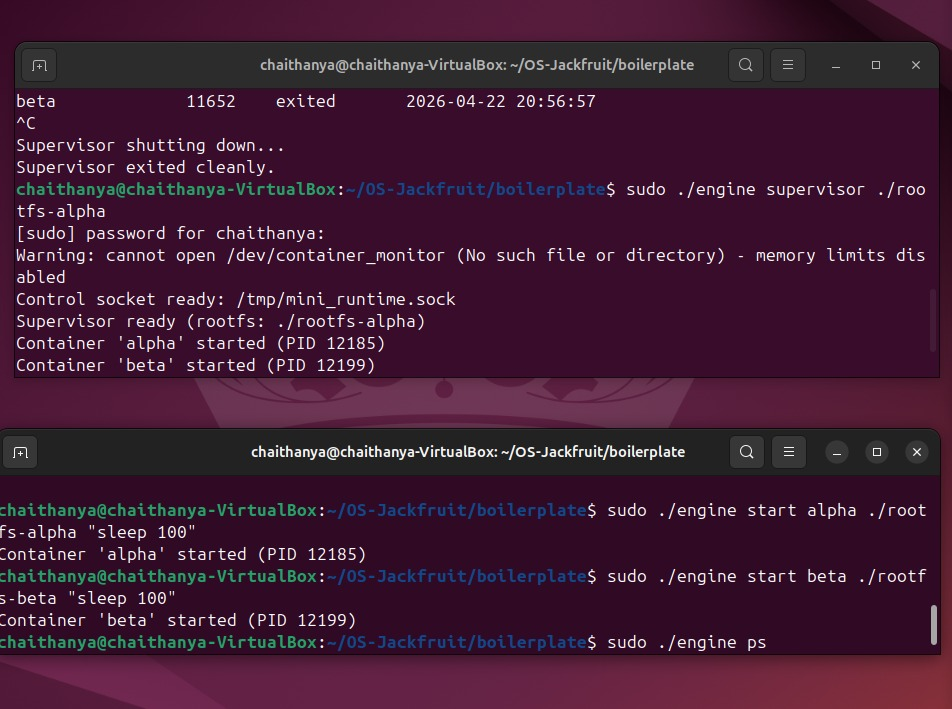
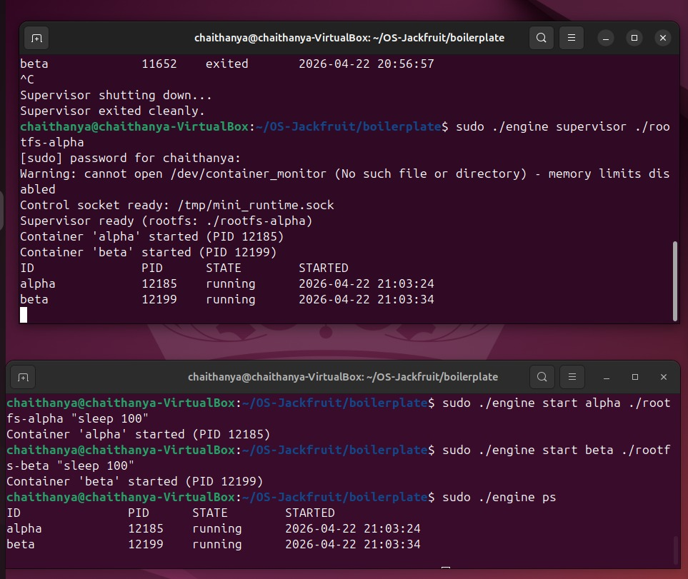
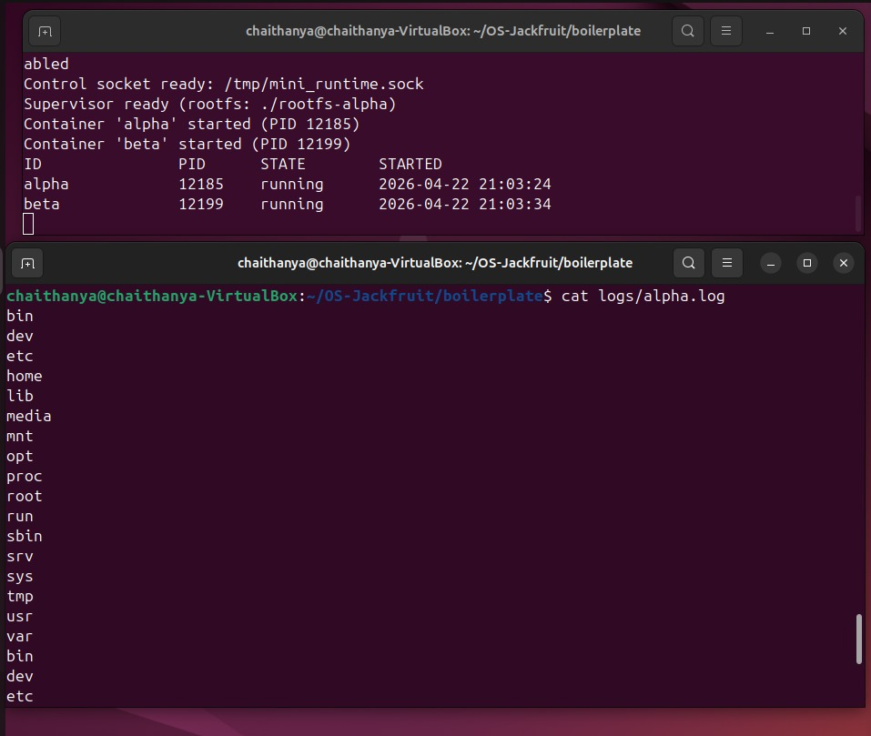
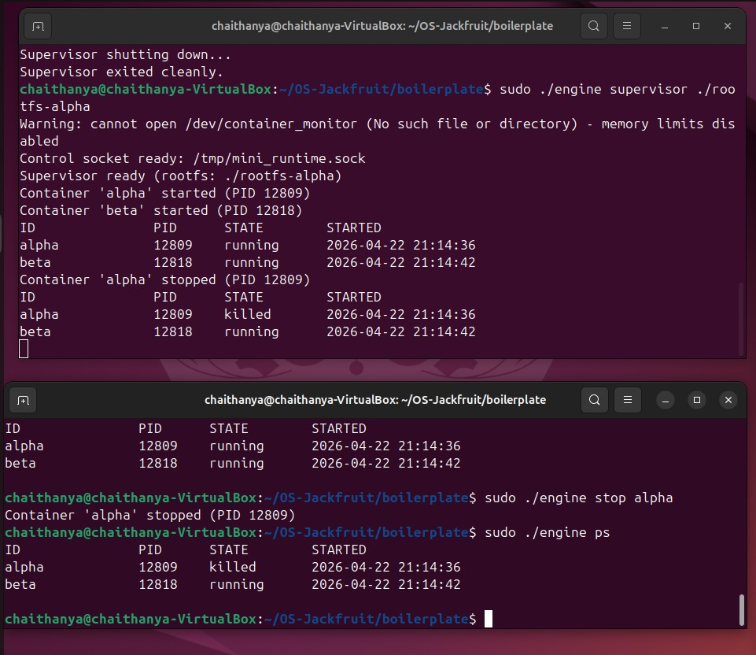
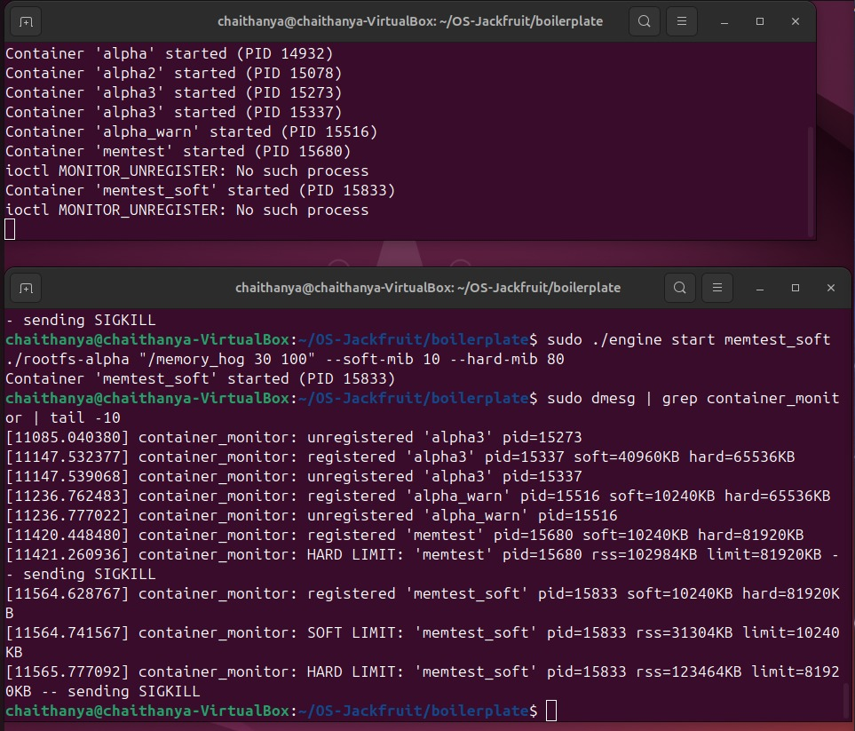
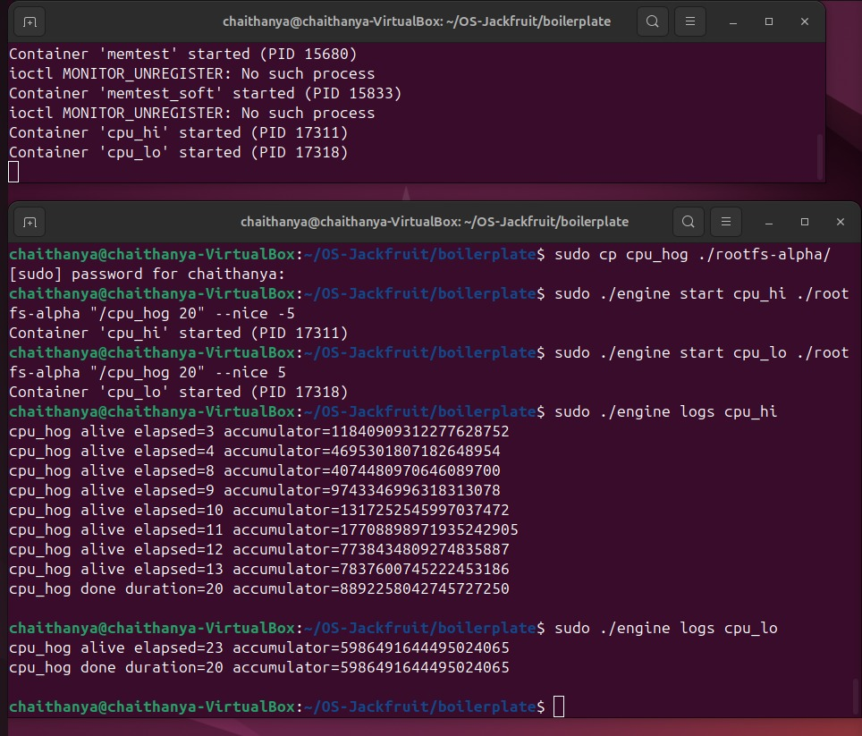
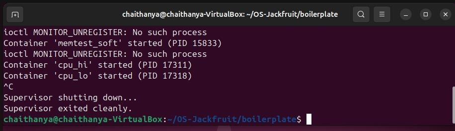
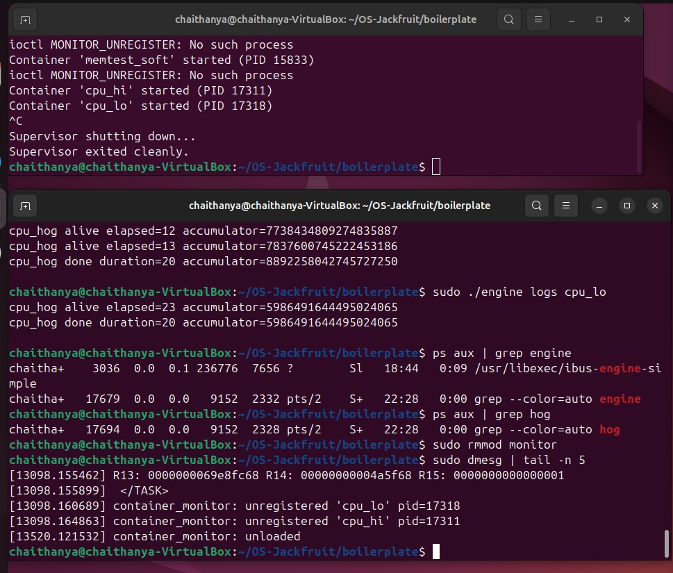

# OS-Jackfruit: Custom Container Runtime

### 1. Team Information
**Member 1**  

**Name:** CHAITHANYA.N  

**SRN:** PES1UG24CS124

**Member 2**  

**Name:** CH YASHWITHA  

**SRN:** PES1UG24CS121
 
### 2. Build , Load and Run Instructions
**i) Environment Setup:**
**Install dependencies**
sudo apt update && sudo apt install -y build-essential linux-headers-$(uname -r)

**Prepare the Alpine root filesystem**
mkdir rootfs-base
wget https://dl-cdn.alpinelinux.org/alpine/v3.20/releases/x86_64/alpine-minirootfs-3.20.3-x86_64.tar.gz
tar -xzf alpine-minirootfs-3.20.3-x86_64.tar.gz -C rootfs-base

**Create writable copies for containers**
cp -a ./rootfs-base ./rootfs-alpha
cp -a ./rootfs-base ./rootfs-beta  

**ii) Compilation and Loading:**
make                               # Build engine and kernel module
sudo insmod monitor.ko             # Load the Kernel Memory Monitor
ls -l /dev/container_monitor       # Verify the control device exists

**iii) Execution (Terminal 1 - Supervisor):**  
sudo ./engine supervisor ./rootfs-base

**iv) Operations (Terminal 2 - CLI):**  
**Start containers with resource limits**
sudo ./engine start alpha ./rootfs-alpha "/bin/sh" --soft-mib 10 --hard-mib 80
sudo ./engine ps                   # View metadata
sudo ./engine logs alpha           # View logs
sudo ./engine stop alpha           # Stop container  

**v) Teardown:**  
**In Terminal 1: Press Ctrl+C to shut down supervisor**
sudo rmmod monitor                 # Unload kernel module
make clean                         # Remove binaries and logs  

### 3. Demo with Screenshots
 **SS1: Multi-container supervision:**  
 Shows the supervisor terminal successfully managing multiple concurrent container lifecycles. 
 
    
  
 **SS2: Metadata tracking:**  
 Output of engine ps displaying Container IDs, PIDs, Memory Limits, and current Status.
 
    
  
 **SS3: Bounded-buffer logging:**  
 Contents of log files showing captured stdout/stderr from the isolated container environment.
 
    
  
 **SS4: CLI and IPC:**   
 Demonstrates a command issued via the CLI being received and processed by the background supervisor.
 
    

 **Memory Enforcement:** 
 **SS5: Soft-limit warning:**    
 **SS6: Hard-limit enforcement:**  
 dmesg output showing a Soft-limit warning (31MB > 10MB) followed by a Hard-limit SIGKILL at 80MB.
 
    
  
 **SS7: Scheduling experiment:**   
 Side-by-side log output showing the high-priority container (nice -5) finishing work faster than the low-priority one.
 
    
  
 **SS8: Clean teardown:**  
 Shows the "Supervisor exited cleanly" message and ps aux confirmation that no zombie processes remain.
 
    
  
  

### 4. Engineering Analysis

#### Isolation Mechanisms   
We achieve isolation using **Linux Namespaces.**  
The **PID Namespace** ensures the container cannot see or kill host processes, providing process-level isolation.  **Mount/chroot** restricts the container to its specific rootfs directory, preventing filesystem escape.  
However, the container still shares the **Host Kernel.** Unlike a VM, there is no guest OS; this means kernel-level resources (like drivers or memory management) are shared, making the runtime more efficient but less isolated than a hypervisor.

#### Supervisor and Process Lifecycle
A long-running parent supervisor is essential for **reaping child processes.** When a container exits, it remains in a "zombie" state until the parent collects its exit code. The supervisor tracks metadata (PIDs, limits) and handles signal delivery, ensuring that a SIGTERM sent to the supervisor triggers an orderly shutdown of all managed children.

#### IPC, Threads, and Synchronization
* **Path A (Logging):** Container stdout/stderr → Supervisor via **Pipes.**
* **Path B (Control):** CLI → Supervisor via **UNIX Domain Sockets.**
* **Synchronization:** We use **Mutexes** on the shared container list. Without mutexes, a race condition could occur if two CLI commands modified the list simultaneously, leading to memory corruption or lost container metadata.

#### Memory Management and Enforcement
* **RSS:** Measures physical RAM currently held by the process. It does *not* measure swapped memory.
* **Limits:** Soft limits are for warnings; Hard limits are for system safety. Enforcement must be in **Kernel Space** because user-space programs can be paused or ignored; the Kernel has the absolute authority to trigger an immediate `SIGKILL`.

#### Scheduling Behavior
Linux uses the **Completely Fair Scheduler (CFS).** Our experiment shows that while the CFS aims for fairness, it respects the "weight" given by **Nice values.** The container with nice -5 received more frequent time-slices, improving its throughput, while the nice 5 container was forced to wait (latency), as seen in the delayed logging.

### 5. Design Decisions and Tradeoffs
**Namespace Isolation (chroot vs pivot_root):**   
* **Choice:** Used chroot for simplicity.
* **Tradeoff:** chroot is less secure as it is technically possible to escape the jail.
* **Justification:** For this educational runtime, chroot effectively demonstrates the concept without the complex mount-point requirements of pivot_root.

**Supervisor Architecture:**
* **Choice:** Single-threaded command listener with multi-threaded logging.
* **Tradeoff:** A very high volume of CLI commands might see slight latency.
* **Justification:** Keeps metadata synchronization simple and prevents race conditions in the container list.

**Kernel Monitor Enforcement:**
* Choice: Periodic polling via a delayed work queue.
* Tradeoff: There is a tiny window (1s) where a process could exceed the limit before being caught.
* Justification: Significantly reduces CPU overhead compared to continuous checking.

### 6. Scheduler Experiment Results
| Container | Nice Value | Start Delay | Result |
| :--- | :--- | :--- | :--- |
| cpu_hi | -5 | ~0.1s | Finished duration 20 quickly |
| cpu_lo | 5  | 23.0s | First logs delayed (elapsed 23) |  

**Analysis:** The results prove that the Linux scheduler prioritizes tasks with lower nice values. The high-priority task saturated the CPU, causing the low-priority task to be "starved" until the high-priority work decreased or the scheduler enforced a fairness window.
